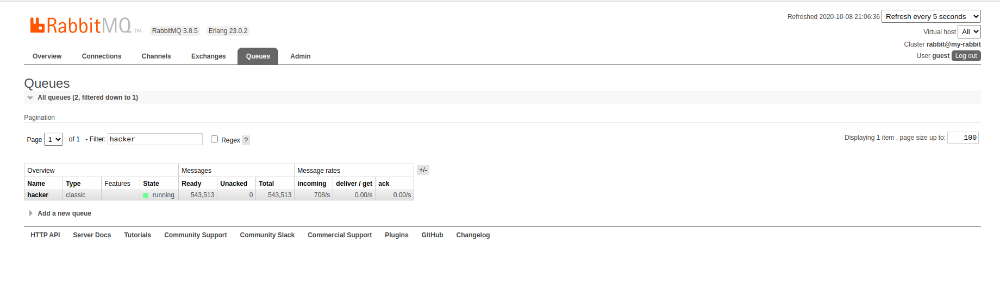
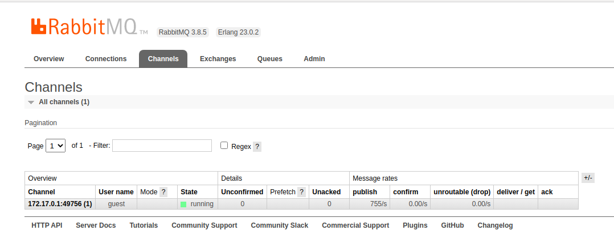
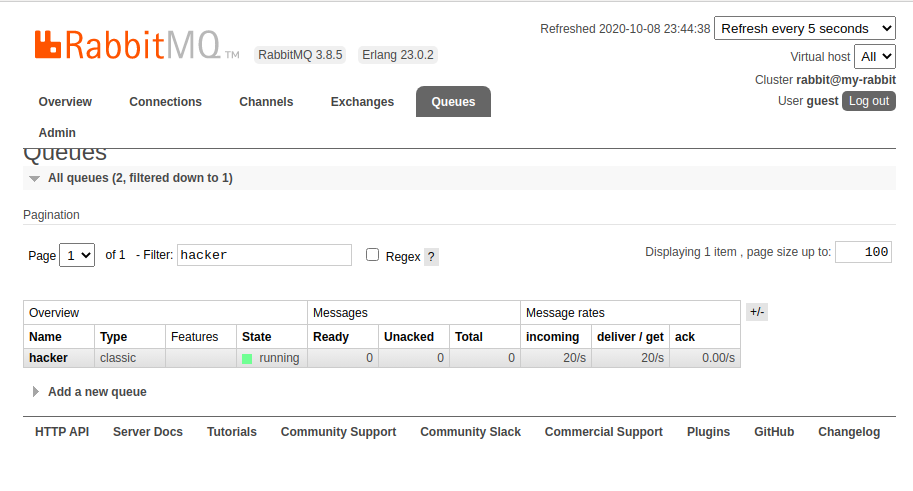
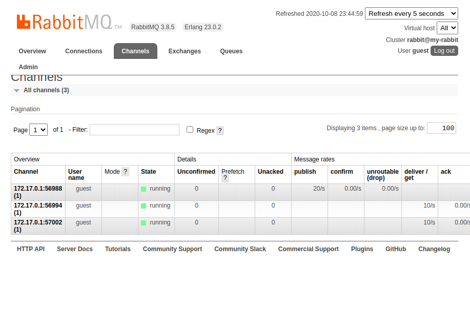
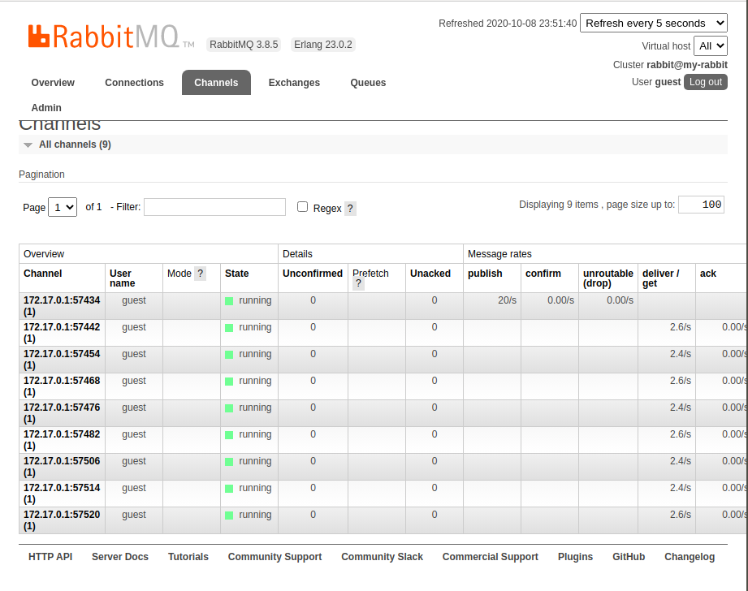
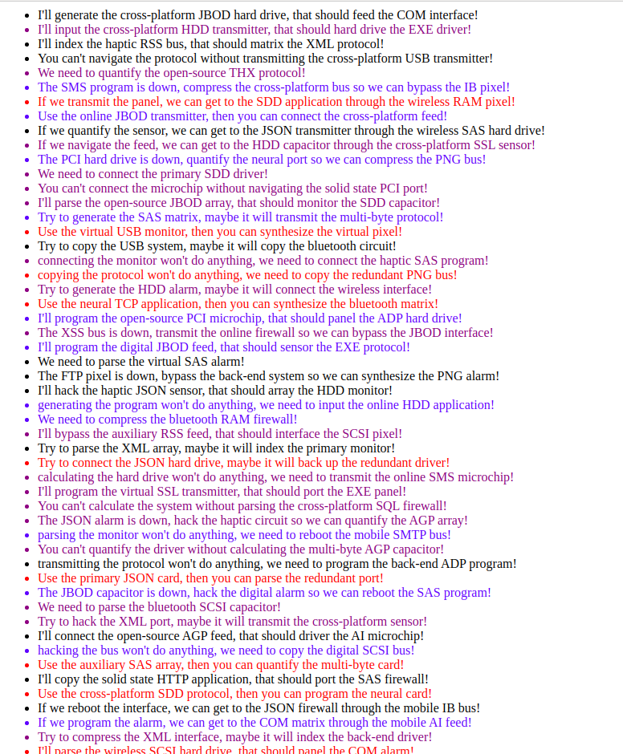

### INSTALLATION

Requeriments 
1. Node.js 
2. Rabbit MQ 

### Install Rabbit MQ Via Docker

`docker run --rm -it --hostname my-rabbit -p 15672:15672 -p 5672:5672 rabbitmq:3-management`

This will start up instance of Rabbit MQ on your local machine. 

### To run on Local Machine
* `git clone https://github.com/ErKiran/simple-message-queue.git`
* `cd simple-message-queue`
* `npm i`
* `npm start`
  
You can also open Rabbit MQ Management Portal on Port 15672.  

`http://localhost:15672/`

Since we are pushing 20 messages a second. Message in the queue pile up pretty Quickly. 

And quickly if we switch to channels tab we can see we are using only mininum number of channel. Which will reduce Rabbit-MQ cost in greater amount. (Earlier I was creating channel inside `setInterval` function which was creating many channels and pretty quickly limit was reached.)

During the Gentel Transfer and Receive Process 

#### If I open multiple connection from the frontend then the multiple channels will be created and that distributes the message rate. 

For example when I open 8 Tabs in browser Message rate was (2.6*4+2.4*4 =20)/s 

#### Architecture
* Publisher publishes 20 random message per second to the Queue
* Consumer consumes all the published message from the queue and only pass those message which has priority greater than 7 (Random)
* Simple Vanilla JS frontend open's up socket connection on browser and listen on the particular events. When the events occurs it displayed the pushed data to DOM. 
Like this 

Then open 
`http://localhost:3000/` on browser.

You can view Hacker Text render on screen. 

